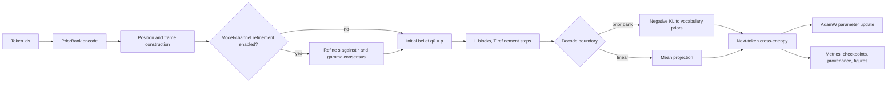

# V3_Transformer

V3_Transformer is an experimental, target-blind structural-refinement sequence model.
Each token is represented by a configured distributional belief and a local gauge frame.
The dataclass defaults, checked-in experiment, and preserved pure profile use Gaussian
beliefs; the reusable engine also exposes a factorized Laplace family. A forward pass
applies a finite number of transport-coupled refinement steps, then trains a next-token
readout with a separate outer cross-entropy objective. The next-token target is absent
from the internal refinement computation.

The preserved pure profile has no learned Q/K/V projections, MLP, or pointwise
activation. That statement applies to a selected configuration, not to every executable
profile. The `VFE3Config()` dataclass defaults and the checked-in `train_vfe3.py`
experiment enable learned components outside that pure profile. The implementation is
registry-heavy, and each configuration claim below names the scope to which it applies.

## Architecture at a glance

The graph shows the generic executable path. Configuration selects the optional
model-channel route, the refinement update, post-block transforms, and the decode
boundary.



`PriorBank.encode` constructs token priors and initial beliefs. `VFEModel.forward_beliefs`
runs the optional model channel and the `L`-by-`T` belief-refinement stack;
`VFEModel.forward` applies the selected decoder. Cross-entropy then supplies the
supervised outer loss and the artifact layer records the run.

## Attention as variational source selection

For query position `i`, let `E_ij` be a fixed scalar comparison between `q_i` and the
transported source `Omega_ij* q_j`, let `pi_ij` be a normalized prior on the active source
support, and let `tau > 0`. The fixed-row objective and its Gibbs minimizer are

$$
\mathcal F_i(\beta_i) = \sum_j \beta_{ij} E_{ij}
+ \tau \sum_j \beta_{ij} \log\frac{\beta_{ij}}{\pi_{ij}},
\qquad
\beta_{ij}^{*} = \frac{\pi_{ij}\exp(-E_{ij}/\tau)}
{\sum_k \pi_{ik}\exp(-E_{ik}/\tau)}.
$$

For positive prior mass on the active support, this is the unique row-wise minimizer at
fixed beliefs, transports, energies, and prior. The relative-entropy term is part of the
stationary softmax result; removing it changes the row problem rather than merely
changing its presentation.

Registry-selected scalar energies preserve this Gibbs calculation because the row
derivation treats `E_ij` as fixed. They do not all acquire the same probabilistic
meaning. The canonical KL construction carries the stated belief-coupling variational
interpretation, and at `tau = 1` the ordinary mixture-KL identity applies. Replacing KL
with another registered divergence still defines a Gibbs source-selection rule, but does
not by itself define an ELBO or make the complete training loop optimize one variational
free energy.

## Execution profiles

The repository exposes an engine and several concrete profiles. They are separate
baselines.

| Profile | Role | Executed choices |
|---|---|---|
| Reusable engine | Configurable inference and training system | Finite Gaussian or Laplace belief refinement with selectable groups, transports, attention priors, update rules, block transforms, decoders, and gradient estimators. |
| `VFE3Config()` defaults | Library construction baseline | Diagonal Gaussian, order-one Renyi/KL energy, block-GL flat phi transport, learned positional phi, one token-prior belief channel, gradient E-step, no head mixer, and an unbiased linear mean decoder. This is not the pure profile. |
| Checked-in `train_vfe3.py` snapshot | Mutable click-to-run experiment | Wikitext-103 with `K=20`, `H=2`, `L=1`, `T=1`; diagonal order-one Renyi/KL energies; block-GL flat phi transport and learned BCH position; same-scale `s -> q` refinement; state-dependent self-coupling; detached precision and gamma prior folds; damped `mm_exact` updates; skipped `q` covariance update; zero phi E-step rate; head mixer; biased linear decode; outer cross-entropy and AdamW. |
| Preserved pure profile | Theory-preserving configuration | Token prior, one `q` channel, flat phi cocycle, canonical attention entropy, constant self-coupling, enabled belief-covariance updates, no mixer, no detached precision prior, and KL-to-prior decode. This is the profile with no learned Q/K/V projections, MLP, or pointwise activation. |
| Opt-in experiments | Explicit extensions and ablations | Full Gaussian or Laplace beliefs, alternate gauge groups, omega-direct frames and reflection sampling, nonflat transports, CG coupling, RoPE or T5 position, alternate decoders, randomized refinement depth, and policy scoring. |

The checked-in row records one source snapshot, not an architectural definition. Editing
the click-to-run dictionary changes that experiment without redefining the reusable
engine or the preserved pure profile.

## End-to-end model flow

### State construction

`PriorBank.encode` maps token ids to a prior state `p_i` and initializes
`q_i^(0) = p_i`. The diagonal Gaussian stores `sigma` as per-coordinate variance, the
full Gaussian stores it as an SPD covariance matrix, and the factorized Laplace family
reuses the same slot for its positive per-coordinate scale `b`, not for covariance. Token
frames are combined with the selected positional construction before pair transport is
evaluated.

### Optional model-channel refinement

When the model channel is active, the model-level state `s_i` is refined against a global
centroid `r` and gamma-weighted transported peers at the same sequence scale. The refined
`s` state becomes the initial state and prior for the `q` channel. A detached gamma
posterior can also be folded into the beta attention prior. When this route is disabled,
the token prior supplies `q_i^(0)` directly.

### Attention prior and belief refinement

The attention-prior builder defines the active support and positional log prior. Optional
detached precision reliability and gamma mixing modify that prior before the Gibbs row is
formed. Each `e_step` iteration constructs transport, evaluates pair energies, computes
Gibbs weights, and applies either a configured gradient step or a damped
majorization-minimization update to the enabled state components. These are finite
filtering iterations; the code does not require or assert an internal limiting state.

### Stack transforms and handoff

`vfe_block` runs `T = n_e_steps` iterations. Optional head mixing, Clebsch-Gordan
coupling, and block normalization act at the configured block boundary. `vfe_stack` runs
`L = n_layers` blocks and uses the configured mean and covariance handoff to construct
the next block prior. With one layer, that inter-block handoff has no downstream block.

### Decode and outer objective

The prior-bank boundary scores a refined belief by negative KL to vocabulary priors. The
linear boundary projects the refined mean and can add a learned vocabulary bias.
Next-token cross-entropy is evaluated after this choice. It is a separate supervised
objective, not an observation term inside every internal E-step and not proof that all
inner and outer updates are coordinate descent on one scalar functional.

### Optimizer routing

`vfe3.train` groups every trainable parameter by role, checks optimizer coverage, and
routes the outer gradients according to the configured unroll or estimator policy. The
checked-in experiment uses AdamW for its active token, model-channel, frame, mixer, and
linear-readout parameters. Other optimizer and frame-update routes remain configuration
choices.

## Geometry and mathematical scope

For unrestricted Gaussian distributions and an invertible common pushforward `A`, KL
has the exact invariance

$$
\mathrm{KL}(A_*q \mathbin{\|} A_*p) = \mathrm{KL}(q \mathbin{\|} p),
\qquad
\Omega_{ij}' = h_i \Omega_{ij} h_j^{-1}.
$$

The second relation is the induced transport law under independent local frame changes.
If `q_i` and `q_j` are pushed forward by `h_i` and `h_j` while transport transforms by
that law, the transported source in frame `i` receives the same common pushforward as
the query. The full-Gaussian KL pair score is therefore invariant.

The diagonal covariance family is not closed under a general GL(K) congruence:
`A diag(sigma) A^T` is usually non-diagonal. The diagonal implementation consequently
projects or approximates the ambient action outside transformations that preserve the
diagonal cone, including monomial transformations. Exact unrestricted GL(K) invariance
must not be assigned to the checked-in diagonal route.

Flat Regime-I transport is a vertex cocycle, `Omega_ij = U_i U_j^-1`. Products around
closed loops cancel to identity, so its loop holonomy is `H = I`. Registered nonflat
edge transports are opt-in experiments, and their gauge guarantees depend on the
selected construction. Nonzero holonomy is not a property of the flat click-run path.

Gaussian covariance statistics carry Fisher and affine-invariant SPD geometry. That fact
does not turn every frame metric, preconditioner, or AdamW frame update into a full-GL
natural gradient. Frame-metric choices and nonflat connection dynamics are experimental
implementation paths with narrower guarantees.

## Registry-driven extension points

The component map links each public responsibility to its source owner.

| Responsibility | Source |
|---|---|
| Configuration, profile fields, and compatibility guards | [`vfe3/config.py`](vfe3/config.py) |
| Belief state and distribution families | [`vfe3/belief.py`](vfe3/belief.py), [`vfe3/families/`](vfe3/families/) |
| Pair divergences and the attention objective | [`vfe3/divergence.py`](vfe3/divergence.py), [`vfe3/free_energy.py`](vfe3/free_energy.py) |
| Self-coupling policies | [`vfe3/alpha_i.py`](vfe3/alpha_i.py) |
| Gauge groups, frames, transport, and retractions | [`vfe3/geometry/`](vfe3/geometry/) |
| Iterative inference and analytic gradients | [`vfe3/inference/e_step.py`](vfe3/inference/e_step.py), [`vfe3/gradients/`](vfe3/gradients/) |
| Model channel, blocks, stack, and forward path | [`vfe3/model/model.py`](vfe3/model/model.py), [`stack.py`](vfe3/model/stack.py), [`block.py`](vfe3/model/block.py) |
| Encode and decode boundaries | [`vfe3/model/prior_bank.py`](vfe3/model/prior_bank.py) |
| Outer training and optimizer coverage | [`vfe3/train.py`](vfe3/train.py) |
| Generation and policy scoring | [`vfe3/inference/policy.py`](vfe3/inference/policy.py), [`generate_efe.py`](generate_efe.py), [`efe_ring_experiment.py`](efe_ring_experiment.py) |
| Run persistence and provenance | [`vfe3/run_artifacts.py`](vfe3/run_artifacts.py) |
| Numeric diagnostics | [`vfe3/metrics.py`](vfe3/metrics.py) |
| Figure extraction and rendering | [`vfe3/viz/`](vfe3/viz/), [`make_figures.py`](make_figures.py) |

Many algebraic seams are selected through registries. Some execution controls, including
the gradient estimator, prior source, gauge parameterization, and omega retraction, use
validated direct dispatch. The code is therefore registry-heavy rather than universally
registry-dispatched.

## Implementation status

| Category | Current boundary |
|---|---|
| Implemented core | Prior-bank encoding, frame construction, transported pair energies, Gibbs attention, finite `q` refinement, block stacking, prior-bank and linear decoders, outer cross-entropy/AdamW training, generation, metrics, and run artifacts. |
| Pure-profile controls | A selectable one-channel, flat-transport, constant-self-coupling, covariance-updating, KL-decoding path remains available without learned Q/K/V projections, MLPs, pointwise activations, a mixer, or detached precision weighting. |
| Opt-in experiments | Full covariance, Laplace beliefs, alternate groups, omega-direct and reflection frames, several nonflat transports, CG coupling, alternate position and decode modes, randomized depth, policy scoring, and richer diagnostics. |
| Partial implementations | The diagonal family projects a general GL(K) action. The same-scale model channel is live, but its `s` refinement is restricted to a diagonal Gaussian, flat model transport, and one global centroid `r`. It is not the full multiscale hierarchy. |
| Deliberate stubs | The registered `gauge_fixed` encode seam raises instead of silently substituting another encoder. The `sigma_mc` policy ambiguity estimator also raises and has no live consumer. |
| Interpretations | Tokens as agents, transported agreement as consensus or predictive coding, layers as inference time, and learning as symmetry breaking are readings of the computation, not additional executable mechanisms. |
| Broader future theory | The full multiscale PIFB hierarchy, distinct model and belief timescales, validated nontrivial holonomy dynamics, and broader physical or philosophical claims remain outside the implemented transformer. |

## Running the repository

### Installation and data

Use Python 3.10 or newer. Install the project and its development, data, and visualization
extras from the repository root:

```powershell
python -m pip install -e ".[dev,data,viz]"
```

Real-corpus entrypoints are cache-only. They expect pre-tokenized `.pt` streams or
`.bin` streams with their sidecars under `~/.cache/tokenized_cache`. The loaders do not
download, tokenize, or replace a missing real corpus with synthetic data.

### Click-to-run workflow

Entrypoints do not parse command-line configuration. Edit the configuration dictionary
near the top of the selected script, then run it directly:

```powershell
python train_vfe3.py
```

| Entrypoint | Scope |
|---|---|
| [`train_vfe3.py`](train_vfe3.py) | Primary cached-corpus training, evaluation, and finalization path. |
| [`ablation.py`](ablation.py) | Named architecture and configuration ablations. |
| [`scaling.py`](scaling.py) | Width, group, and training-budget scaling runs. |
| [`make_figures.py`](make_figures.py) | Regenerates eligible figures from a saved run. |
| [`generate_efe.py`](generate_efe.py) | Checkpoint-based generation and policy comparison driver. |
| [`efe_ring_experiment.py`](efe_ring_experiment.py) | Controlled ring experiment for goal-directed policy scoring. |

### Test commands

The project-level pytest configuration already supplies quiet output. Do not append a
second `-q` when a visible summary is required.

Run the default CPU-oriented suite with:

```powershell
python -m pytest
```

Include tests marked as slow with:

```powershell
python -m pytest --runslow
```

Route device-aware tests to CUDA with:

```powershell
$env:VFE3_TEST_DEVICE = "cuda"
python -m pytest
```

## Outputs and diagnostics

When a [`RunArtifacts`](vfe3/run_artifacts.py) instance is supplied, a run directory under
`vfe3_runs/` becomes the durable record.

| Artifact | Contents |
|---|---|
| `config.json` | Full configuration plus run metadata. |
| `metrics.csv` | Periodic training, validation, and diagnostic rows. |
| `checkpoints/step_<N>.pt` | Resumable model, optimizer, RNG, configuration, and step state. |
| `best_model.pt` | Semantic best-validation model bundle with configuration fingerprint. |
| `test_results.json` | Held-out test evaluation after reloading the best checkpoint. |
| `provenance.json` | Git, environment, and dataset provenance. |
| `summary.json` | Headline end-of-run values and timing. |
| `pure_path_report.json` | Configuration audit attempted during every finalization; write failures are logged and skipped. |
| `research.json` and figure files | Optional research probes and diagnostic or publication-oriented plots. |

Cheap history figures are produced during finalization. Heavier replay figures obey
`generate_figures` and can be regenerated by `make_figures.py`. Numeric artifacts remain
available when optional visualization fails.

## Repository map

```text
V3_Transformer/
|-- vfe3/
|   |-- families/       belief distributions and divergences
|   |-- geometry/       groups, transports, frames, and retractions
|   |-- gradients/      analytic and autograd refinement kernels
|   |-- inference/      E-step and policy machinery
|   |-- model/          PriorBank, blocks, stack, and VFEModel
|   |-- viz/            extraction, diagnostics, and figures
|   |-- config.py       validated configuration surface
|   |-- free_energy.py fixed-row and scored objective components
|   |-- train.py        optimizer and training loop
|   '-- run_artifacts.py
|-- tests/              regression, property, gradient, and integration tests
|-- docs/               design, audit, experiment, and edit records
|-- Manuscripts-Theory/ working theory manuscripts
|-- train_vfe3.py       primary click-to-run experiment
|-- ablation.py         ablation entrypoint
|-- scaling.py          scaling entrypoint
'-- pyproject.toml      package and pytest configuration
```

## Theory and manuscripts

The repository contains working manuscript copies, not an authority that overrides the
active code or every broader theoretical claim. The [GL(K) attention manuscript](<Manuscripts-Theory/GL(K)_attention.tex>)
develops the principal attention and gauge construction, while its
[supplement](<Manuscripts-Theory/GL(K)_supplementary.tex>) records supporting derivations
and scope. The [PIFB manuscript](<Manuscripts-Theory/PIFB.tex>) is a broader companion
framework; its full multiscale program is not implemented by this repository.

For implementation intent and review history, use the source-linked code map above and
the records under [`docs/`](docs/). Where a manuscript interpretation and an executable
profile differ, the checked-in configuration and runtime path determine what the program
actually computes.
