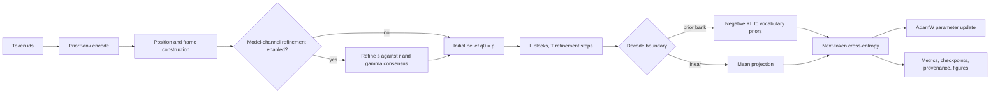

# V3_Transformer

V3_Transformer is an experimental, target-blind structural-refinement sequence model.
Each token is represented by a configured distributional belief and a local gauge frame.
The dataclass defaults, checked-in experiment, and preserved pure profile use Gaussian
beliefs; the reusable engine also exposes a factorized Laplace family. A forward pass
applies a finite number of transport-coupled refinement steps, then trains a next-token
readout with a separate outer cross-entropy objective. The next-token target is absent
from the internal refinement computation.

The preserved pure profile has no learned Q/K/V projections, MLP, or pointwise
activation. That statement applies to a selected configuration, not to every executable
profile. The `VFE3Config()` dataclass defaults and the checked-in `train_vfe3.py`
experiment enable learned components outside that pure profile. The implementation is
registry-heavy, and each configuration claim below names the scope to which it applies.

## Architecture at a glance

The graph shows the generic executable path. Configuration selects the optional
model-channel route, the refinement update, post-block transforms, and the decode
boundary.



`PriorBank.encode` constructs token priors and initial beliefs. `VFEModel.forward_beliefs`
runs the optional model channel and the `L`-by-`T` belief-refinement stack;
`VFEModel.forward` applies the selected decoder. Cross-entropy then supplies the
supervised outer loss and the artifact layer records the run.

## Mathematical state and transport

The model uses the following notation throughout the derivation.

| Symbol | Meaning |
|---|---|
| $q_i$ | Refined Gaussian belief at token $i$ |
| $p_i$ | Token prior and initial belief supplied to the belief channel |
| $s_i$ | Optional model-channel Gaussian state |
| $r$ | Global, token-independent Gaussian hyper-prior for the model channel |
| $\beta_{ij}^{(h)}$ | Belief-channel source weight from token $j$ to token $i$ in head $h$ |
| $\gamma_{ij}^{(h)}$ | Model-channel source weight from token $j$ to token $i$ in head $h$ |
| $\phi_i$ | Coordinates of token $i$ in the registered gauge Lie algebra |
| $U_i$ | Group-valued local frame obtained from $\phi_i$ |
| $\Omega_{ij}$ | Relative transport that expresses token $j$ in token $i$'s frame |
| $K$ | Total belief dimension |
| $H$ | Number of equal gauge blocks and attention heads |
| $d_h$ | Dimension of one equal block, $K/H$ |

Three scopes are kept separate below. An **ambient exact result** is a theorem for unrestricted
full Gaussians and invertible pushforwards. A **reusable-engine formula** is an implemented route
whose assumptions are stated with it. A **checked-in specialization** records the branches and
values selected by the committed `train_vfe3.py`; it is not an architectural restriction.

At ambient scope, each token carries a full Gaussian and a frame in an equal-block general linear
group. The reusable phi route forms the raw algebra matrix from registered generators. On the
checked-in non-skew path, the matrix supplied to the exponential is the effective matrix obtained
by the whole-frame Frobenius-norm safeguard:

$$
\begin{aligned}
q_i &= \mathcal N(\mu_i,\Sigma_i), &
\mu_i &\in \mathbb R^K, &
\Sigma_i &\in \mathrm{SPD}(K), \\
A_i &= \sum_a \phi_i^a G_a \in \mathfrak g, &
\widehat A_i
&= \begin{cases}
A_i, & \lVert A_i\rVert_F\leq 20, \\
20A_i/\lVert A_i\rVert_F, & \lVert A_i\rVert_F>20,
\end{cases} \\
U_i &= \exp(\widehat A_i), &
\Omega_{ij} &= U_iU_j^{-1}, \\
G_{\mathrm{block}} &= \prod_{h=1}^{H}\mathrm{GL}(d_h), &
d_h &= K/H, &
U_i &= \mathrm{diag}\left(U_i^{(1)},\ldots,U_i^{(H)}\right).
\end{aligned}
$$

The piecewise formula describes forward values. The implementation computes its scale under
`torch.no_grad()` and multiplies by that detached scale, so autograd treats the current scale as a
constant. Outer frame gradients therefore differentiate through the scaled matrix exponential but
are not the derivative of the displayed radial normalization.

The checked-in specialization has $K=20$, $H=2$, and $d_h=10$, so its effective frame has two
$\mathrm{GL}^{+}(10)$ blocks. Every real matrix exponential has positive determinant, but
the real exponential map is not surjective onto the positive-determinant component. Within
$\lVert A_i\rVert_F\leq20$, the map agrees with the ordinary exponential parameterization. Outside
that region, the safeguard collapses radial magnitudes onto the norm-20 boundary, so the effective
map is not itself a chart. Its joint frame image is restricted to
$\exp\lbrace B\in\mathfrak g:\lVert B\rVert_F\leq20\rbrace$, a strict subset of the unclamped block-group
exponential image; each block remains in
$\mathrm{im}(\exp:\mathfrak{gl}(10)\to\mathrm{GL}^{+}(10))
\subsetneq\mathrm{GL}^{+}(10)$.

For an ambient full Gaussian, transport is the exact pushforward. The checked-in diagonal family
uses the reusable engine's projected covariance operation, where $\sigma_j$ is a variance vector
and $\mathrm{Diag}(\sigma_j)$ is its diagonal covariance matrix:

$$
\begin{aligned}
\widetilde\mu_{ij} &= \Omega_{ij}\mu_j, \\
\widetilde\Sigma_{ij} &= \Omega_{ij}\Sigma_j\Omega_{ij}^{\top}, \\
\widetilde\sigma_{ij} &= \mathrm{diag}\left(
\Omega_{ij}\mathrm{Diag}(\sigma_j)\Omega_{ij}^{\top}
\right).
\end{aligned}
$$

Unrestricted congruence is exact and closed on full covariances. It is not closed on the diagonal
family under a general $\mathrm{GL}(K)$ transport: the diagonal cone is preserved for every
diagonal input only by monomial transformations. The final line above is therefore a diagonal
projection of a full covariance sandwich, not an unrestricted gauge action within the diagonal
family.

For $P=\mathcal N(\mu_P,\Sigma_P)$ and $Q=\mathcal N(\mu_Q,\Sigma_Q)$, the ambient comparison is
the forward Gaussian KL. The checked-in route evaluates its diagonal, per-head specialization on
$I_h=\lbrace (h-1)d_h+1,\ldots,hd_h\rbrace$:

$$
\begin{aligned}
D_{\mathrm{KL}}(P\Vert Q)
&= \frac12\left[
\mathrm{tr}(\Sigma_Q^{-1}\Sigma_P)
+(\mu_P-\mu_Q)^{\top}\Sigma_Q^{-1}(\mu_P-\mu_Q)
-K
+\log\frac{\det\Sigma_Q}{\det\Sigma_P}
\right], \\
E_{ij}^{(h)}
&= C_{[0,K_{\max}]}\left[
\frac12\sum_{k\in I_h}\left(
\frac{\sigma_{ik}}{\widetilde\sigma_{ij,k}}
+\frac{(\widetilde\mu_{ij,k}-\mu_{ik})^2}{\widetilde\sigma_{ij,k}}
-1
+\log\frac{\widetilde\sigma_{ij,k}}{\sigma_{ik}}
\right)
\right].
\end{aligned}
$$

Before division or logarithms, diagonal variances are floored at $\varepsilon=10^{-6}$.
$C_{[0,K_{\max}]}$ clamps finite values to $[0,K_{\max}]$, maps NaN and positive infinity to
$K_{\max}$, and maps negative infinity to zero. The checked-in setting chooses order-one Renyi,
which is forward KL with the belief as its first argument, and sets $K_{\max}=8K=160$.

The ambient full-Gaussian pair score also has an exact local gauge law. For arbitrary invertible
frame changes $h_i$ and $h_j$, the transported source and query change together, while vertex-frame
transport obeys a flat cocycle:

$$
\begin{aligned}
q_i' &= (h_i)_{\ast}q_i, &
q_j' &= (h_j)_{\ast}q_j, &
\Omega_{ij}' &= h_i\Omega_{ij}h_j^{-1}, \\
D_{\mathrm{KL}}\left(q_i'\Vert(\Omega_{ij}')_{\ast}q_j'\right)
&= D_{\mathrm{KL}}\left(q_i\Vert(\Omega_{ij})_{\ast}q_j\right), \\
\Omega_{ij}\Omega_{jk} &= \Omega_{ik}, &
\Omega_{ij}\Omega_{jk}\Omega_{ki} &= I.
\end{aligned}
$$

This invariance theorem is limited to ambient full-Gaussian pushforwards. The projected diagonal
route, the linear readout, and the untied head mixer are outside it, so it is not a theorem of
whole-model gauge invariance. Flatness is the operator identity obtained from
$\Omega_{ij}=U_iU_j^{-1}$; it does not imply path independence for repeated diagonal projection,
because projection is not a group action.

## Attention as variational source selection

For a fixed query $i$ and head $h$, let $\pi_{ij}^{(h)}$ be a normalized prior on the active
source support. Minimize over the probability simplex $\beta_{ij}^{(h)}\geq 0$ and
$\sum_j\beta_{ij}^{(h)}=1$, with $\tau_h>0$ (equivalently $\kappa_\beta>0$). Holding beliefs,
transports, comparison energies, and that prior fixed then gives the entropy-regularized row
objective and its normalized Gibbs solution:

$$
\begin{aligned}
\mathcal F_i^{(h)}(\beta_i^{(h)})
&= \sum_j \beta_{ij}^{(h)}E_{ij}^{(h)}
+\tau_h\sum_j\beta_{ij}^{(h)}
\log\frac{\beta_{ij}^{(h)}}{\pi_{ij}^{(h)}}, \\
\tau_h &= \kappa_\beta\sqrt{d_h}, \\
\beta_{ij}^{(h)\ast}
&= \frac{\pi_{ij}^{(h)}\exp\left(-E_{ij}^{(h)}/\tau_h\right)}
{\sum_k\pi_{ik}^{(h)}\exp\left(-E_{ik}^{(h)}/\tau_h\right)}.
\end{aligned}
$$

For positive prior mass on the active support, strict convexity at $\tau_h>0$ makes this the unique
row-wise constrained minimizer under those fixed quantities. The checked-in profile has
$\kappa_\beta=\kappa_\gamma=1$ and $d_h=10$, hence
$\tau_\beta=\tau_\gamma=\sqrt{10}$. The relative-entropy term is part of the stationary Gibbs
result; removing it changes the row problem rather than merely changing its presentation.

Registry-selected scalar energies preserve this Gibbs calculation because the row
derivation treats $E_{ij}^{(h)}$ as fixed. They do not all acquire the same probabilistic
meaning. The canonical KL construction carries the stated belief-coupling variational
interpretation, and at $\tau=1$ the ordinary mixture-KL identity applies. Replacing KL
with another registered divergence still defines a Gibbs source-selection rule, but does
not by itself define an ELBO or make the complete training loop optimize one variational
free energy.

## Full variational free energy: continuum theory and the 0D language model

### Evidence bound on an explicit support

Let $(\mathcal X,\nu)$ be a latent measured space, let $p_\theta(o,x)$ be a normalized
joint density, and let $q(x)$ be a variational density. Assume $p_\theta(o)>0$,
$q\ll p_\theta(\cdot\mid o)$, and finite displayed integrals. The ordinary single-system
variational free energy is the negative of the evidence lower bound:

$$
\begin{aligned}
\mathcal F[q,\theta;o]
&:= \int_{\mathrm{supp}(q)}q(x)
\log\frac{q(x)}{p_\theta(o,x)}d\nu(x) \\
&= \int_{\mathrm{supp}(q)}q(x)
\log\frac{q(x)}{p_\theta(x\mid o)}d\nu(x)
-\log p_\theta(o) \\
&= \int_{\mathrm{supp}(q)}q(x)
\log\frac{q(x)}{p_\theta(x)}d\nu(x)
-\int_{\mathrm{supp}(q)}q(x)
\log p_\theta(o\mid x)d\nu(x) \\
&=D_{\mathrm{KL}}\left(q\Vert p_\theta(\cdot\mid o)\right)
-\log p_\theta(o)
\geq -\log p_\theta(o).
\end{aligned}
$$

The first integral is the definition, the second equality substitutes Bayes' rule, and the third
splits the joint density into prior and likelihood. The bound follows from nonnegativity of
forward KL. If the required absolute continuity fails, the corresponding KL and free energy are
$+\infty$ rather than a finite objective.

The interacting theory below retains this complexity-minus-accuracy structure and adds
gauge-transported consensus energies. Those source components contain neighboring variational
beliefs, so the population functional is an engineered consensus-energy extension; it is not, in
general, the KL of one variational distribution against a fixed global generative model. The
single-system evidence bound above therefore does not become an end-to-end evidence-bound theorem
for the coupled population merely by adding the alignment sectors.

### Continuum functional with base and fiber supports

Let $\mathcal C$ be a base manifold equipped with measure $\mu_{\mathcal C}$. Agent $i$ is
present through a smooth support field $\chi_i:\mathcal C\to[0,1]$, with pair support
$\chi_{ij}(c):=\chi_i(c)\chi_j(c)$. At $c\in\mathcal C$, the densities
$q_i(k\mid c)$ and $p_i(k\mid c)$ live on the state fiber with reference measure
$\nu^q_{i,c}$, while $s_i(m\mid c)$ and $r_i(m\mid c)$ live on the model fiber with reference
measure $\nu^s_{i,c}$. Define the corresponding probability measures by

$$
\begin{aligned}
dQ_i^c(k)&:=q_i(k\mid c)d\nu^q_{i,c}(k), &
dP_i^c(k)&:=p_i(k\mid c)d\nu^q_{i,c}(k), \\
dS_i^c(m)&:=s_i(m\mid c)d\nu^s_{i,c}(m), &
dR_i^c(m)&:=r_i(m\mid c)d\nu^s_{i,c}(m).
\end{aligned}
$$

Define the active fiber supports
$\mathcal K_i(c):=\mathrm{supp}(q_i(\cdot\mid c))$ and
$\mathcal M_i(c):=\mathrm{supp}(s_i(\cdot\mid c))$.

When the transported source measures are dominated by the receiver reference measures, write their
Radon–Nikodym densities as

$$
\begin{aligned}
\overline q_{j\to i}(k\mid c)
&:=\frac{d\left[(\Omega^q_{ij}(c))_{\ast}Q_j^c\right]}
{d\nu^q_{i,c}}(k), \\
\overline s_{j\to i}(m\mid c)
&:=\frac{d\left[(\Omega^s_{ij}(c))_{\ast}S_j^c\right]}
{d\nu^s_{i,c}}(m).
\end{aligned}
$$

The state self-divergence, model hyper-prior divergence, two transported comparison energies,
and observation accuracy are then explicit support integrals:

$$
\begin{aligned}
\mathcal D_i^q(c)
&:=D_{\mathrm{KL}}(Q_i^c\Vert P_i^c) \\
&=\int_{\mathcal K_i(c)}q_i(k\mid c)
\log\frac{q_i(k\mid c)}{p_i(k\mid c)}d\nu^q_{i,c}(k), \\
\mathcal D_i^s(c)
&:=D_{\mathrm{KL}}(S_i^c\Vert R_i^c) \\
&=\int_{\mathcal M_i(c)}s_i(m\mid c)
\log\frac{s_i(m\mid c)}{r_i(m\mid c)}d\nu^s_{i,c}(m), \\
\mathcal E_{ij}^q(c)
&:=D_{\mathrm{KL}}\left(Q_i^c\Vert(\Omega^q_{ij}(c))_{\ast}Q_j^c\right) \\
&=\int_{\mathcal K_i(c)}q_i(k\mid c)
\log\frac{q_i(k\mid c)}{\overline q_{j\to i}(k\mid c)}d\nu^q_{i,c}(k), \\
\mathcal E_{ij}^s(c)
&:=D_{\mathrm{KL}}\left(S_i^c\Vert(\Omega^s_{ij}(c))_{\ast}S_j^c\right) \\
&=\int_{\mathcal M_i(c)}s_i(m\mid c)
\log\frac{s_i(m\mid c)}{\overline s_{j\to i}(m\mid c)}d\nu^s_{i,c}(m), \\
\mathcal A_i(c)
&:=\int_{\mathcal K_i(c)}q_i(k\mid c)
\log p_\theta\left(o_i(c)\mid k,m_i(c),c\right)d\nu^q_{i,c}(k).
\end{aligned}
$$

The measure-level KL definitions are primary. Each transported comparison is $+\infty$ unless its
receiver measure is absolutely continuous with respect to the transported source measure. The
density equalities additionally require the displayed common dominating measures; ambient
Gaussian fibers satisfy that condition. Finiteness of the self-sectors likewise requires
$Q_i^c\ll P_i^c$ and $S_i^c\ll R_i^c$. The model parameter $m_i(c)$ is held fixed inside the
observation expectation, matching the canonical PIFB functional's expectation over $q_i$.

Let $\pi_{ij}^{q}(c)$ and $\pi_{ij}^{s}(c)$ be pre-mask source priors. Absorb pair support into
normalized active-row priors. The row masses and their domains are

$$
\begin{aligned}
\rho_i^q(c)&:=\sum_\ell\chi_{i\ell}(c)\pi_{i\ell}^{q}(c), &
\mathcal C_i^q&:=\lbrace c\in\mathcal C:\rho_i^q(c)>0\rbrace, \\
\rho_i^s(c)&:=\sum_\ell\chi_{i\ell}(c)\pi_{i\ell}^{s}(c), &
\mathcal C_i^s&:=\lbrace c\in\mathcal C:\rho_i^s(c)>0\rbrace, \\
\widetilde\pi_{ij}^{q}(c)
&:=\frac{\chi_{ij}(c)\pi_{ij}^{q}(c)}{\rho_i^q(c)},
& c&\in\mathcal C_i^q, \\
\widetilde\pi_{ij}^{s}(c)
&:=\frac{\chi_{ij}(c)\pi_{ij}^{s}(c)}{\rho_i^s(c)},
& c&\in\mathcal C_i^s, \\
\beta_{ij}(c)&\geq0, & \sum_j\beta_{ij}(c)&=1,
& c&\in\mathcal C_i^q, \\
\gamma_{ij}(c)&\geq0, & \sum_j\gamma_{ij}(c)&=1,
& c&\in\mathcal C_i^s.
\end{aligned}
$$

Rows are defined only on active receiver support. Every row sum below is restricted to entries with
positive normalized prior; forbidden entries have $\beta_{ij}=\gamma_{ij}=0$. We use the
continuous extension $0\log(0/\pi)=0$ for $\pi>0$, while positive mass on a zero-prior source
has infinite categorical KL. For fixed $c\in\mathcal C_i^q$, use the source-independent
factorization
$\mathcal Q_i(k,j\mid c)=\beta_{ij}(c)q_i(k\mid c)$ and
$\mathcal P_i(k,j\mid c)=\widetilde\pi_{ij}^{q}(c)\overline q_{j\to i}(k\mid c)$. Each complete
belief row at unit temperature is then exactly a KL on the joint source-state space:

$$
\begin{aligned}
D_{\mathrm{KL}}(\mathcal Q_i\Vert\mathcal P_i)
&=\sum_j\int_{\mathcal K_i(c)}\beta_{ij}(c)q_i(k\mid c)
\log\frac{\beta_{ij}(c)q_i(k\mid c)}
{\widetilde\pi_{ij}^{q}(c)\overline q_{j\to i}(k\mid c)}d\nu^q_{i,c}(k) \\
&=\sum_j\beta_{ij}(c)
\left[
\mathcal E_{ij}^q(c)
+\log\frac{\beta_{ij}(c)}{\widetilde\pi_{ij}^{q}(c)}
\right].
\end{aligned}
$$

The model identity follows by replacing
$(q,\overline q,\beta,\widetilde\pi^q)$ with
$(s,\overline s,\gamma,\widetilde\pi^s)$. A general positive temperature scales the
categorical relative entropy and yields the tempered row objective derived in the preceding
section. With channel temperatures $\tau_\beta,\tau_\gamma>0$ and model hyper-prior weight
$\lambda_h>0$, the canonical one-scale continuum functional is

$$
\begin{aligned}
\mathcal F_{\mathcal C}
&:=\sum_i\int_{\mathcal C}\chi_i(c)\mathcal D_i^q(c)d\mu_{\mathcal C}(c) \\
&\quad+\lambda_h\sum_i\int_{\mathcal C}
\chi_i(c)\mathcal D_i^s(c)d\mu_{\mathcal C}(c) \\
&\quad+\sum_{i,j}\int_{\mathcal C_i^q}\beta_{ij}(c)
\left[
\mathcal E_{ij}^q(c)
+\tau_\beta\log\frac{\beta_{ij}(c)}{\widetilde\pi_{ij}^{q}(c)}
\right]d\mu_{\mathcal C}(c) \\
&\quad+\sum_{i,j}\int_{\mathcal C_i^s}\gamma_{ij}(c)
\left[
\mathcal E_{ij}^s(c)
+\tau_\gamma\log\frac{\gamma_{ij}(c)}{\widetilde\pi_{ij}^{s}(c)}
\right]d\mu_{\mathcal C}(c) \\
&\quad-\sum_i\int_{\mathcal C}\chi_i(c)\mathcal A_i(c)d\mu_{\mathcal C}(c).
\end{aligned}
$$

At a populated hierarchy scale $\zeta$, the parent meta-agent $I=\mathrm{pa}(i)$ supplies the
state prior and model hyper-prior as cross-scale transported shadows:

$$
\begin{aligned}
p_i^{(\zeta)}
&=\left(\Omega_{iI}^{q,(\zeta)}\right)_{\ast}q_I^{(\zeta+1)}, \\
r_i^{(\zeta)}
&=\left(\Omega_{iI}^{s,(\zeta)}\right)_{\ast}s_I^{(\zeta+1)}.
\end{aligned}
$$

Adding the scale superscript to every field gives the same five-sector functional at each
populated scale under the PIFB closure ansatz. The arrows $r\to s$ and $p\to q$ are therefore
within-fiber prior relations, while the construction of $p$ and $r$ is cross-scale; it is not a
same-scale causal chain $s\to p$.

This is the full, unminimized functional: $\beta$ and $\gamma$ remain variational row fields and
their categorical relative entropies are present. The canonical state self-term has unit weight.
Its adaptive-precision extension replaces the first integrand by

$$
\begin{aligned}
\mathcal D_i^q(c)
&\longmapsto a_i(c)\mathcal D_i^q(c)+R(a_i(c)), \\
R(a)&:=b_0a-c_0\log a, \\
a_i^{\ast}(c)&=\frac{c_0}{b_0+\mathcal D_i^q(c)},
\qquad b_0,c_0>0.
\end{aligned}
$$

The regularizer is part of the adaptive functional; dropping it changes both the optimum and the
envelope derivative. Setting $a_i=1$ and $R=0$ recovers the canonical self-sector.

Minimizing the active row fields while holding beliefs, transports, supports, and priors fixed
gives

$$
\begin{aligned}
Z_i^q(c)
&:=\sum_j\widetilde\pi_{ij}^{q}(c)
\exp\left[-\mathcal E_{ij}^q(c)/\tau_\beta\right], \\
Z_i^s(c)
&:=\sum_j\widetilde\pi_{ij}^{s}(c)
\exp\left[-\mathcal E_{ij}^s(c)/\tau_\gamma\right], \\
\beta_{ij}^{\ast}(c)
&=\frac{\widetilde\pi_{ij}^{q}(c)
\exp\left[-\mathcal E_{ij}^q(c)/\tau_\beta\right]}{Z_i^q(c)}, \\
\gamma_{ij}^{\ast}(c)
&=\frac{\widetilde\pi_{ij}^{s}(c)
\exp\left[-\mathcal E_{ij}^s(c)/\tau_\gamma\right]}{Z_i^s(c)}.
\end{aligned}
$$

Substitution turns each complete energy-plus-entropy row into $-\tau_\beta\log Z_i^q(c)$ or
$-\tau_\gamma\log Z_i^s(c)$. The entropy-suppressed sums
$\sum_j\beta_{ij}^{\ast}\mathcal E_{ij}^q$ and
$\sum_j\gamma_{ij}^{\ast}\mathcal E_{ij}^s$ are different scalar functions, not alternate
spellings of that reduced envelope.

### Zero-dimensional language-model specialization

For the transformer, collapse the base to one point
$\mathcal C_0=\lbrace c_0\rbrace$ with $\mu_{\mathcal C_0}(\lbrace c_0\rbrace)=1$ and
$\chi_i(c_0)=1$ for every present token. Then

$$
\int_{\mathcal C_0}\chi_i(c)f_i(c)d\mu_{\mathcal C_0}(c)=f_i(c_0).
$$

All base-coordinate derivatives disappear; $i$ now indexes token-agents, and causal or padding
support is carried by finite active source sets $\mathcal J_i^{q,h}$ and
$\mathcal J_i^{s,h}$ and their normalized priors rather than by a spatial support field. The
general zero-dimensional library supports an undivided fiber or registered unequal irreducible
blocks. The
checked-in `block_glk` profile splits each state and model fiber into $H$ equal blocks of dimension
$d_h=K/H$. The repository also exposes positive whole-sector scales $\lambda_\beta$ and
$\lambda_\gamma$; because each multiplies an entire row functional, neither changes that row's
Gibbs minimizer. The resulting observation-inclusive KL reference for that equal-block profile is

$$
\begin{aligned}
\mathcal F_{\mathrm{0D}}^{\mathrm{KL}}
&:=\sum_i\left[a_iD_{\mathrm{KL}}(q_i\Vert p_i)+R(a_i)\right]
+\lambda_h\sum_iD_{\mathrm{KL}}(s_i\Vert r) \\
&\quad+\lambda_\beta\sum_{h,i}\sum_{j\in\mathcal J_i^{q,h}}
\beta_{ij}^{(h)}
\left[
E_{ij}^{q,h}
+\tau_{\beta,h}\log\frac{\beta_{ij}^{(h)}}{\pi_{ij}^{q,h}}
\right] \\
&\quad+\lambda_\gamma\sum_{h,i}\sum_{j\in\mathcal J_i^{s,h}}
\gamma_{ij}^{(h)}
\left[
E_{ij}^{s,h}
+\tau_{\gamma,h}\log\frac{\gamma_{ij}^{(h)}}{\pi_{ij}^{s,h}}
\right] \\
&\quad-\sum_i\mathbb E_{k_i\sim q_i}
\left[\log p_\theta(o_i\mid k_i,m_i)\right],
\end{aligned}
$$

where

$$
\begin{aligned}
E_{ij}^{q,h}
&:=D_{\mathrm{KL}}\left(
q_i^{(h)}\Vert(\Omega_{ij}^{q,h})_{\ast}q_j^{(h)}
\right), \\
E_{ij}^{s,h}
&:=D_{\mathrm{KL}}\left(
s_i^{(h)}\Vert(\Omega_{ij}^{s,h})_{\ast}s_j^{(h)}
\right), \\
\tau_{\beta,h}&:=\kappa_\beta\sqrt{d_h}, &
\tau_{\gamma,h}&:=\kappa_\gamma\sqrt{d_h}, \\
\sum_{j\in\mathcal J_i^{q,h}}\beta_{ij}^{(h)}&=1, &
\sum_{j\in\mathcal J_i^{s,h}}\gamma_{ij}^{(h)}&=1.
\end{aligned}
$$

In the checked-in tied-frame, flat-transport route,
$\Omega_{ij}^{s,h}=\Omega_{ij}^{q,h}=\Omega_{ij}^{(h)}$; an independent model-frame registry
entry can replace the model transport. The one-step model refinement then supplies
$q_i^{(0)}=p_i=s_i^{(1)}$, and the continuum hyper-prior field $r_i(c)$ specializes to the
global token-independent $r$. At `renyi_order=1.0`, the registered Rényi family selects the
forward-KL formula required by the evidence-bound and joint-mixture readings. The executable
diagonal route can subsequently project transported covariances and clamp scalar energies, so its
reported comparison energy need not equal the ambient support integral everywhere. Other
registered divergences retain the fixed-energy Gibbs row algebra but define generalized structural
objectives rather than the negative ELBO displayed above.

The last observation term completes the theoretical 0D VFE; it is not active inside the deployed
model or belief refinements. The checked-in path first performs one target-blind $s$ refinement,
sets $q^{(0)}=p=s^{(1)}$, and then performs one target-blind $q$ refinement. A separate linear
decode and next-token cross-entropy train parameters through those finite unrolled updates. The
implementation therefore constructs an inferred state with the two structural free-energy slices;
it does not minimize $\mathcal F_{\mathrm{0D}}^{\mathrm{KL}}$ end to end or establish monotone
descent of one shared ELBO.

## Inner objectives and executable updates

The belief channel is defined relative to a target-blind structural objective. Its one-hop term
uses the belief attention weights and the same entropy regularizer that produces the Gibbs row solution.
The checked-in state-dependent self-coupling profiles the positive coefficient $a_i$ against its
regularizer in the same objective:

$$
\begin{aligned}
\mathcal F_q
&:= \sum_i\left[a_iD(q_i\Vert p_i)+R(a_i)\right]
+\lambda_\beta\sum_{h,i,j}\beta_{ij}^{(h)}
\left[
E_{ij}^{q,h}
+\tau_{\beta,h}\log\frac{\beta_{ij}^{(h)}}{\pi_{ij}^{q,h}}
\right], \\
R(a) &:= b_0a-c_0\log a, &
a_i^{\ast} &:= \frac{c_0}{b_0+D(q_i\Vert p_i)}.
\end{aligned}
$$

The optional detached two-hop coefficient is zero in the checked-in profile. Here $b_0=c_0=1$
and the only belief iteration starts from $q_i^{(0)}=p_i$. It therefore evaluates
$D(q_i^{(0)}\Vert p_i)=0$ and $a_i^{\ast}=1$ at that initialization; this value is not asserted away
from that state.

The model channel has its own target-blind objective. It balances the same-scale hyper-prior
against gamma-weighted transported consensus, then hands its single refined state to both the
belief initialization and the belief prior:

$$
\begin{aligned}
\mathcal F_s
&:= \lambda_h\sum_iD_{\mathrm{KL}}(s_i\Vert r)
+\lambda_\gamma\sum_{h,i,j}\gamma_{ij}^{(h)}
\left[
E_{ij}^{s,h}
+\tau_{\gamma,h}\log\frac{\gamma_{ij}^{(h)}}{\pi_{ij}^{s,h}}
\right], \\
\lambda_h &= 0.25, &
\lambda_\gamma &= 0.75, &
\tau_{\gamma,h} &= \sqrt{10}, &
q_i^{(0)} &= p_i=s_i^{(1)}.
\end{aligned}
$$

The global $r$ is token-independent and frozen because `learnable_r=False`. This is an
implemented same-scale hierarchy, not the full multiscale PIFB theory. Its finite schedule does
not establish a slower learned model timescale.

Before the belief step, the refined model covariance supplies a detached global reliability bias.
The gamma posterior is then mixed with that reliability-adjusted belief prior in probability
space:

$$
\begin{aligned}
\rho_j
&:= -\log\left(2+\mathrm{tr}\Sigma_{s,j}^{(1)}\right), &
\pi_{hij}^{b}
&:= \mathrm{softmax}_j\left(B_{hij}^{q}+\rho_j\right), \\
\overline\pi_{hij}^{q}
&:= (1-w)\pi_{hij}^{b}
+w\mathrm{stopgrad}\left(\gamma_{ij}^{(h)}\right), &
w&=0.5.
\end{aligned}
$$

The prior-mixture weight $w=0.5$ is distinct from the model-coupling coefficient
$\lambda_\gamma=0.75$. The final belief attention uses $\overline\pi^q$ in its Gibbs rule. The
detached fold changes the belief forward update without carrying a gradient into $s$ through that
edge.

For the active diagonal-KL `mm_exact` route, let $h(k)$ be the head containing coordinate $k$.
Hold the attention weights, transported keys, current self coefficient, and clamp masks fixed.
Absorb the self mask into $c_{ik}:=m_i^{\mathrm{self}}a_i^{\ast}$ and use the strict pair mask in the
nonnegative effective pair weight. On a nondegenerate coordinate, the precision fusion is

$$
\begin{aligned}
c_{ik} &:= m_i^{\mathrm{self}}a_i^{\ast}\geq 0, &
m_{ij}^{(h)} &:= \mathbf{1}_{0<E_{ij}^{(h)}<K_{\max}}, \\
w_{ijk} &:= \lambda_\beta m_{ij}^{(h(k))}\beta_{ij}^{(h(k))}\geq 0, \\
P_{ik}
&:= \frac{c_{ik}}{\sigma_{p,ik}}
+\sum_j\frac{w_{ijk}}{\widetilde\sigma_{ij,k}}, \\
\mu_{ik}^{\ast}
&:= \frac{
c_{ik}\mu_{p,ik}/\sigma_{p,ik}
+\sum_jw_{ijk}\widetilde\mu_{ij,k}/\widetilde\sigma_{ij,k}
}{P_{ik}}, &
\sigma_{ik}^{\ast}
&:= \frac{c_{ik}+\sum_jw_{ijk}}{P_{ik}}.
\end{aligned}
$$

With those quantities fixed, these formulas are closed-form minimizers over the enabled,
nondegenerate coordinates of the mask-selected diagonal-KL surrogate implemented by `mm_exact`.
The strict pair mask excludes exactly zero-energy pairs. The resulting surrogate is therefore not
a majorizer of the canonical frozen-attention objective, and the update has no majorization,
descent, or exact self-consistent-argmin guarantee. If every effective precision on a coordinate is
suppressed by a clamp, the implementation retains the current belief rather than applying the
displayed nondegenerate quotient.

When covariance is enabled, `mm_exact` damping is performed in Gaussian natural coordinates. The
checked-in model step uses this covariance-enabled route with $\eta=0.75$. The belief step uses the
same damping value but freezes covariance, so its mean is damped directly in mean coordinates:

$$
\begin{aligned}
\Lambda &:= \Sigma^{-1}, &
\Lambda^{+} &:= (1-\eta)\Lambda+\eta\Lambda^{\ast}, \\
(\Lambda\mu)^{+}
&:= (1-\eta)\Lambda\mu+\eta\Lambda^{\ast}\mu^{\ast}, &
\eta&=0.75, \\
\mu^{(1)}&=0.25\mu^{(0)}+0.75\mu^{\ast}, &
\sigma^{(1)}&=\sigma^{(0)}, &
\phi^{(1)}&=\phi^{(0)}.
\end{aligned}
$$

Thus the `s` step updates covariance, whereas the `q` E-step freezes covariance and frames.
`e_phi_lr=0` does not freeze outer frame learning: the checked-in plain AdamW route uses
`m_phi_lr=0.010`. Covariance can also change outside the `q` E-step through the upstream `s`
refinement and the active head mixer.

The reusable engine separately registers the Gaussian Fisher-gradient route. For full covariance
and its diagonal variance specialization, respectively, its natural gradients are

$$
\begin{aligned}
\widetilde\nabla_{\mu}\mathcal F
&:= \Sigma\nabla_{\mu}\mathcal F, &
\widetilde\nabla_{\Sigma}\mathcal F
&:= 2\Sigma\mathrm{sym}\left(\nabla_{\Sigma}\mathcal F\right)\Sigma, \\
\widetilde\nabla_{\mu}\mathcal F
&:= \sigma\odot\nabla_{\mu}\mathcal F, &
\widetilde\nabla_{\sigma}\mathcal F
&:= 2\sigma^2\odot\nabla_{\sigma}\mathcal F.
\end{aligned}
$$

These equations describe the reusable registered gradient route, which is inactive under the
checked-in `mm_exact` selection. They do not describe the frame AdamW update, and they do not imply
convergence of the finite refinement schedule.

**Objective boundary.** $\mathcal F_s$ and $\mathcal F_q$ are target-blind structural objectives;
the supervised outer next-token cross-entropy is separate. Under the checked-in route, each inner
stage takes one damped step toward a mask-selected `mm_exact` fusion target, not an exact
self-consistent argmin. The production forward pass therefore does not optimize one ELBO and has
no majorization, surrogate-descent, shared-functional EM monotonicity, evidence-ascent,
convergence, or global-free-energy-descent guarantee.

## Execution profiles

The repository exposes an engine and several concrete profiles. They are separate
baselines.

| Profile | Role | Executed choices |
|---|---|---|
| Reusable engine | Configurable inference and training system | Finite Gaussian or Laplace belief refinement with selectable groups, transports, attention priors, update rules, block transforms, decoders, and gradient estimators. |
| `VFE3Config()` defaults | Library construction baseline | Diagonal Gaussian, order-one Renyi/KL energy, block-GL flat phi transport, learned positional phi, one token-prior belief channel, gradient E-step, no head mixer, and an unbiased linear mean decoder. This is not the pure profile. |
| Checked-in `train_vfe3.py` snapshot | Mutable click-to-run experiment | Wikitext-103 with `K=20`, `H=2`, `L=1`, `T=1`; diagonal order-one Renyi/KL energies; block-GL flat phi transport and learned BCH position; same-scale `s -> q` refinement; state-dependent self-coupling; detached precision and gamma prior folds; damped `mm_exact` updates; skipped `q` covariance update; zero phi E-step rate; head mixer; biased linear decode; outer cross-entropy and AdamW. |
| Preserved pure profile | Theory-preserving configuration | Token prior, one `q` channel, flat phi cocycle, canonical attention entropy, constant self-coupling, enabled belief-covariance updates, no mixer, no detached precision prior, and KL-to-prior decode. This is the profile with no learned Q/K/V projections, MLP, or pointwise activation. |
| Opt-in experiments | Explicit extensions and ablations | Full Gaussian or Laplace beliefs, alternate gauge groups, omega-direct frames and reflection sampling, nonflat transports, CG coupling, RoPE or T5 position, alternate decoders, randomized refinement depth, and policy scoring. |

The checked-in row records one source snapshot, not an architectural definition. Editing
the click-to-run dictionary changes that experiment without redefining the reusable
engine or the preserved pure profile.

## End-to-end model flow

### State construction

`PriorBank.encode` maps token ids to a prior state `p_i` and initializes
`q_i^(0) = p_i`. The diagonal Gaussian stores `sigma` as per-coordinate variance, the
full Gaussian stores it as an SPD covariance matrix, and the factorized Laplace family
reuses the same slot for its positive per-coordinate scale `b`, not for covariance. Token
frames are combined with the selected positional construction before pair transport is
evaluated.

### Optional model-channel refinement

When the model channel is active, the model-level state `s_i` is refined against a global
centroid `r` and gamma-weighted transported peers at the same sequence scale. The refined
`s` state becomes the initial state and prior for the `q` channel. A detached gamma
posterior can also be folded into the beta attention prior. When this route is disabled,
the token prior supplies `q_i^(0)` directly.

### Attention prior and belief refinement

The attention-prior builder defines the active support and positional log prior. Optional
detached precision reliability and gamma mixing modify that prior before the Gibbs row is
formed. Each `e_step` iteration constructs transport, evaluates pair energies, computes
Gibbs weights, and applies either a configured gradient step or a damped, mask-selected
closed-form fusion to the enabled state components. These are finite
filtering iterations; the code does not require or assert an internal limiting state.

### Stack transforms and handoff

`vfe_block` runs `T = n_e_steps` iterations. Optional head mixing, Clebsch-Gordan
coupling, and block normalization act at the configured block boundary. `vfe_stack` runs
`L = n_layers` blocks and uses the configured mean and covariance handoff to construct
the next block prior. With one layer, that inter-block handoff has no downstream block.

### Decode and outer objective

Two alternative registered decode boundaries map the refined belief to vocabulary logits. Let
$m_i$ be the mean of $q_i^{\ast}$, let $W_v$ and $b_v$ be the linear readout parameters for vocabulary
item $v$, and let $p_v^{\mathrm{decode}}$ be its decode-bank Gaussian prior. With $M$ equal to the
number of targets not masked by $-100$, the two logit boundaries and the supervised objective are

$$
\begin{aligned}
z_{iv} &= m_i^{\top}W_v+b_v
&& \text{(linear boundary)}, \\
z_{iv} &= -\frac{D_{\mathrm{KL}}\left(q_i^{\ast}\Vert p_v^{\mathrm{decode}}\right)}
{\tau_{\mathrm{decode}}}
&& \text{(KL-to-prior boundary)}, \\
\mathcal L_{\mathrm{CE}}
&= -\frac{1}{M}\sum_{b,i:y_{bi}\ne-100}
\log\mathrm{softmax}(z_{bi})_{y_{bi}}.
\end{aligned}
$$

The first and second logit equations are alternatives, not additive score terms. The checked-in
experiment sets `use_prior_bank=False` and `decode_bias=True`, so it selects the registered linear
boundary. Its logits depend on the refined mean and learned bias; belief covariance and
$\tau_{\mathrm{decode}}$ do not enter them. Setting `use_prior_bank=True` exposes the registered
prior-bank modes, including the displayed KL-to-prior boundary, while other registered decode
modes retain their own stated scoring rules.

The causal training windows use $x_i=t_i$ and $y_i=t_{i+1}$. At the checked-in values
`mass_phi=0`, `mstep_self_coupling_weight=0`, and `z_loss_weight=0`, no corresponding outer
penalty augments cross-entropy. Because `s_e_step=True`, the explicit hyper-prior and gamma outer
blocks are also gated off rather than scored a second time after their structural role in the
model refinement. The backpropagated scalar is therefore exactly next-token cross-entropy through
the unrolled `s` and `q` paths. This outer scalar is not identical to either target-blind inner
structural objective $\mathcal F_s$ or $\mathcal F_q$.

### Optimizer routing

`vfe3.train` groups every trainable parameter by role, checks optimizer coverage, and
routes the outer gradients according to the configured unroll or estimator policy. The
checked-in experiment uses AdamW for its active model-channel, frame, mixer, and linear-readout
parameters. Under `prior_source="model_channel"`, the token-prior mean and variance tables remain
grouped but are inactive: they receive no gradient, parameter update, or weight decay. Other
optimizer and frame-update routes remain configuration choices.

## Geometry and mathematical scope

The ambient invariance and induced local transport law are stated in the mathematical
core above. If `q_i` and `q_j` are pushed forward by `h_i` and `h_j` while transport
transforms by that law, the transported source in frame `i` receives the same common
pushforward as the query. The full-Gaussian KL pair score is therefore invariant.

The diagonal covariance family is not closed under a general GL(K) congruence:
`A diag(sigma) A^T` is usually non-diagonal. The diagonal implementation consequently
projects or approximates the ambient action outside transformations that preserve the
diagonal cone, including monomial transformations. Exact unrestricted GL(K) invariance
must not be assigned to the checked-in diagonal route.

Flat Regime-I transport is a vertex cocycle, `Omega_ij = U_i U_j^-1`. Products around
closed loops cancel to identity, so its loop holonomy is `H = I`. Registered nonflat
edge transports are opt-in experiments, and their gauge guarantees depend on the
selected construction. Nonzero holonomy is not a property of the flat click-run path.

Gaussian covariance statistics carry Fisher and affine-invariant SPD geometry. That fact
does not turn every frame metric, preconditioner, or AdamW frame update into a full-GL
natural gradient. Frame-metric choices and nonflat connection dynamics are experimental
implementation paths with narrower guarantees.

## Registry-driven extension points

The component map links each public responsibility to its source owner.

| Responsibility | Source |
|---|---|
| Configuration, profile fields, and compatibility guards | [`vfe3/config.py`](vfe3/config.py) |
| Belief state and distribution families | [`vfe3/belief.py`](vfe3/belief.py), [`vfe3/families/`](vfe3/families/) |
| Pair divergences and the attention objective | [`vfe3/divergence.py`](vfe3/divergence.py), [`vfe3/free_energy.py`](vfe3/free_energy.py) |
| Self-coupling policies | [`vfe3/alpha_i.py`](vfe3/alpha_i.py) |
| Gauge groups, frames, transport, and retractions | [`vfe3/geometry/`](vfe3/geometry/) |
| Iterative inference and analytic gradients | [`vfe3/inference/e_step.py`](vfe3/inference/e_step.py), [`vfe3/gradients/`](vfe3/gradients/) |
| Model channel, blocks, stack, and forward path | [`vfe3/model/model.py`](vfe3/model/model.py), [`stack.py`](vfe3/model/stack.py), [`block.py`](vfe3/model/block.py) |
| Encode and decode boundaries | [`vfe3/model/prior_bank.py`](vfe3/model/prior_bank.py) |
| Outer training and optimizer coverage | [`vfe3/train.py`](vfe3/train.py) |
| Generation and policy scoring | [`vfe3/inference/policy.py`](vfe3/inference/policy.py), [`generate_efe.py`](generate_efe.py), [`efe_ring_experiment.py`](efe_ring_experiment.py) |
| Run persistence and provenance | [`vfe3/run_artifacts.py`](vfe3/run_artifacts.py) |
| Numeric diagnostics | [`vfe3/metrics.py`](vfe3/metrics.py) |
| Figure extraction and rendering | [`vfe3/viz/`](vfe3/viz/), [`make_figures.py`](make_figures.py) |

Many algebraic seams are selected through registries. Some execution controls, including
the gradient estimator, prior source, gauge parameterization, and omega retraction, use
validated direct dispatch. The code is therefore registry-heavy rather than universally
registry-dispatched.

## Implementation status

| Category | Current boundary |
|---|---|
| Implemented core | Prior-bank encoding, frame construction, transported pair energies, Gibbs attention, finite `q` refinement, block stacking, prior-bank and linear decoders, outer cross-entropy/AdamW training, generation, metrics, and run artifacts. |
| Pure-profile controls | A selectable one-channel, flat-transport, constant-self-coupling, covariance-updating, KL-decoding path remains available without learned Q/K/V projections, MLPs, pointwise activations, a mixer, or detached precision weighting. |
| Opt-in experiments | Full covariance, Laplace beliefs, alternate groups, omega-direct and reflection frames, several nonflat transports, CG coupling, alternate position and decode modes, randomized depth, policy scoring, and richer diagnostics. |
| Partial implementations | The diagonal family projects a general GL(K) action. The same-scale model channel is live, but its `s` refinement is restricted to a diagonal Gaussian, flat model transport, and one global centroid `r`. It is not the full multiscale hierarchy. |
| Deliberate stubs | The registered `gauge_fixed` encode seam raises instead of silently substituting another encoder. The `sigma_mc` policy ambiguity estimator also raises and has no live consumer. |
| Interpretations | Tokens as agents, transported agreement as consensus or predictive coding, layers as inference time, and learning as symmetry breaking are readings of the computation, not additional executable mechanisms. |
| Broader future theory | The full multiscale PIFB hierarchy, distinct model and belief timescales, validated nontrivial holonomy dynamics, and broader physical or philosophical claims remain outside the implemented transformer. |

## Running the repository

### Installation and data

Use Python 3.10 or newer. Install the project and its development, data, and visualization
extras from the repository root:

```powershell
python -m pip install -e ".[dev,data,viz]"
```

Real-corpus entrypoints are cache-only. They expect pre-tokenized `.pt` streams or
`.bin` streams with their sidecars under `~/.cache/tokenized_cache`. The loaders do not
download, tokenize, or replace a missing real corpus with synthetic data.

### Click-to-run workflow

Entrypoints do not parse command-line configuration. Edit the configuration dictionary
near the top of the selected script, then run it directly:

```powershell
python train_vfe3.py
```

| Entrypoint | Scope |
|---|---|
| [`train_vfe3.py`](train_vfe3.py) | Primary cached-corpus training, evaluation, and finalization path. |
| [`ablation.py`](ablation.py) | Named architecture and configuration ablations. |
| [`scaling.py`](scaling.py) | Width, group, and training-budget scaling runs. |
| [`make_figures.py`](make_figures.py) | Regenerates eligible figures from a saved run. |
| [`generate_efe.py`](generate_efe.py) | Checkpoint-based generation and policy comparison driver. |
| [`efe_ring_experiment.py`](efe_ring_experiment.py) | Controlled ring experiment for goal-directed policy scoring. |

### Test commands

The project-level pytest configuration already supplies quiet output. Do not append a
second `-q` when a visible summary is required.

Run the default CPU-oriented suite with:

```powershell
python -m pytest
```

Include tests marked as slow with:

```powershell
python -m pytest --runslow
```

Route device-aware tests to CUDA with:

```powershell
$env:VFE3_TEST_DEVICE = "cuda"
python -m pytest
```

## Outputs and diagnostics

When a [`RunArtifacts`](vfe3/run_artifacts.py) instance is supplied, a run directory under
`vfe3_runs/` becomes the durable record.

| Artifact | Contents |
|---|---|
| `config.json` | Full configuration plus run metadata. |
| `metrics.csv` | Periodic training, validation, and diagnostic rows. |
| `checkpoints/step_<N>.pt` | Resumable model, optimizer, RNG, configuration, and step state. |
| `best_model.pt` | Semantic best-validation model bundle with configuration fingerprint. |
| `test_results.json` | Held-out test evaluation after reloading the best checkpoint. |
| `provenance.json` | Git, environment, and dataset provenance. |
| `summary.json` | Headline end-of-run values and timing. |
| `pure_path_report.json` | Configuration audit attempted during every finalization; write failures are logged and skipped. |
| `research.json` and figure files | Optional research probes and diagnostic or publication-oriented plots. |

Cheap history figures are produced during finalization. Heavier replay figures obey
`generate_figures` and can be regenerated by `make_figures.py`. Numeric artifacts remain
available when optional visualization fails.

## Repository map

```text
V3_Transformer/
|-- vfe3/
|   |-- families/       belief distributions and divergences
|   |-- geometry/       groups, transports, frames, and retractions
|   |-- gradients/      analytic and autograd refinement kernels
|   |-- inference/      E-step and policy machinery
|   |-- model/          PriorBank, blocks, stack, and VFEModel
|   |-- viz/            extraction, diagnostics, and figures
|   |-- config.py       validated configuration surface
|   |-- free_energy.py fixed-row and scored objective components
|   |-- train.py        optimizer and training loop
|   '-- run_artifacts.py
|-- tests/              regression, property, gradient, and integration tests
|-- docs/               design, audit, experiment, and edit records
|-- Manuscripts-Theory/ working theory manuscripts
|-- train_vfe3.py       primary click-to-run experiment
|-- ablation.py         ablation entrypoint
|-- scaling.py          scaling entrypoint
'-- pyproject.toml      package and pytest configuration
```

## Theory and manuscripts

The repository contains working manuscript copies, not an authority that overrides the
active code or every broader theoretical claim. The [GL(K) attention manuscript](<Manuscripts-Theory/GL(K)_attention.tex>)
develops the principal attention and gauge construction, while its
[supplement](<Manuscripts-Theory/GL(K)_supplementary.tex>) records supporting derivations
and scope. The [PIFB manuscript](<Manuscripts-Theory/PIFB.tex>) is a broader companion
framework; its full multiscale program is not implemented by this repository.

For implementation intent and review history, use the source-linked code map above and
the records under [`docs/`](docs/). Where a manuscript interpretation and an executable
profile differ, the checked-in configuration and runtime path determine what the program
actually computes.
