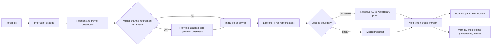

# Expert Architecture README Implementation Plan

> **For agentic workers:** REQUIRED SUB-SKILL: Use superpowers:subagent-driven-development (recommended) or superpowers:executing-plans to implement this plan task-by-task. Steps use checkbox (`- [ ]`) syntax for tracking.

**Goal:** Replace `README.md` with an expert, architecture-first GitHub landing page that accurately separates the reusable engine, preserved pure path, checked-in experiment, optional extensions, and broader theory.

**Architecture:** The README will center one Mermaid execution graph and one entropy-regularized attention derivation, then map the model's data flow, gauge scope, configuration profiles, registries, operational entrypoints, artifacts, and implementation status to live source. The rewrite is documentation-only and retains the repository's click-to-run workflow.

**Tech Stack:** GitHub-flavored Markdown, Mermaid, Python/PyTorch source references, PowerShell verification, Git.

## Global Constraints

- Work only in `C:\tmp\V3_Transformer_readme_architecture_20260711` on branch `codex/readme-architecture-20260711`.
- Treat `origin/main` commit `01204cfb7374` as the traced implementation baseline unless a fresh fetch shows that it advanced.
- Do not modify source, configuration, tests, manuscripts, run artifacts, or the Research vault.
- Use American English and avoid the project's banned prose patterns.
- Do not use LaTeX spacing macros `\;`, `\,`, or `\!`.
- Do not claim that finite internal refinements converge, that the complete training loop optimizes one ELBO/VFE, or that the diagonal family realizes exact unrestricted GL(K) invariance.
- Do not report historical pass counts or benchmark results in the README.
- Do not run pytest; the user explicitly waived tests for this documentation task.
- Update `docs/2026-07-11-edits.md`, the existing same-day post-edit record.
- Preserve every file and configuration change in the user's live checkout.

---

### Task 1: Replace the README with the approved expert architecture document

**Files:**

- Modify: `README.md`
- Modify: `docs/2026-07-11-edits.md`
- Reference: `docs/superpowers/specs/2026-07-11-readme-architecture-design.md`

**Interfaces:**

- Consumes: `VFEModel.forward_beliefs`, `VFEModel.forward`, `vfe_stack`, `vfe_block`, `e_step`, `PriorBank`, `free_energy`, `train`, and `RunArtifacts` as the implementation contract.
- Produces: a self-contained public README whose relative links resolve inside the repository and whose configuration claims name their profile explicitly.

- [ ] **Step 1: Record the stale baseline markers**

Run:

```powershell
rg -n "only learnable objects|converged belief|single authoritative scalar|every modeling seam|model channel.*partially|canonical copies" README.md
```

Expected: the current README contains several of these unqualified statements, establishing the documentation defects the rewrite removes.

- [ ] **Step 2: Replace `README.md` with the approved section structure**

Use `apply_patch` to replace the file with these exact top-level sections, in order:

```markdown
# V3_Transformer

## Architecture at a glance
## Attention as variational source selection
## Execution profiles
## End-to-end model flow
## Geometry and mathematical scope
## Registry-driven extension points
## Implementation status
## Running the repository
## Outputs and diagnostics
## Repository map
## Theory and manuscripts
```

The introduction must define the project as an experimental, target-blind structural-refinement sequence model whose outer objective is next-token cross-entropy. It must state the no-Q/K/V, no-MLP, no-activation property only for the preserved pure profile.

The architecture section must contain one GitHub Mermaid block with this semantic graph:



The final graph may add a nested refinement subgraph for transport, pair energy, Gibbs weights, and gradient-or-MM updates, but it must preserve these node meanings and optional branches.

The attention section must include the exact fixed-row objective and Gibbs solution from the approved design. It must explain that the entropy term is part of the stationary softmax result, that registry-selected scalar energies preserve the Gibbs row calculation, and that only the appropriate KL construction carries the stated variational interpretation.

The execution-profile table must contain separate rows for the reusable engine, `VFE3Config()` defaults, the checked-in `train_vfe3.py` snapshot, the preserved pure profile, and opt-in experiments. The checked-in row must record the traced K=20, H=2, L=1, T=1 two-channel damped-MM route with skipped q covariance, zero phi E-step rate, head mixer, and biased linear decode.

The implementation-status section must distinguish implemented core, pure-profile controls, opt-in experiments, partial implementations, deliberate stubs, interpretations, and broader future theory. It must identify `gauge_fixed`, `sigma_mc`, the same-scale model-channel restrictions, and the full multiscale PIFB boundary accurately.

The operational sections must include Python 3.10+, editable installation, the cache-only real-corpus contract, click-to-run configuration, entrypoints, artifact files, default/slow/CUDA test commands, and a concise repository tree.

- [ ] **Step 3: Update the dated edit record**

Append a final implementation paragraph to the existing `## Expert architecture README design` section in `docs/2026-07-11-edits.md`. Record the README rewrite, its source-tracing basis, the corrected pure/current/theory boundaries, the Mermaid graph, the operational additions, and the fact that pytest was not run by user direction.

- [ ] **Step 4: Run first-pass documentation checks**

Run:

```powershell
git diff --check
rg -n "^#{1,3} " README.md
$stylePatterns = @(
    ('col' + 'our'), ('behav' + 'iour'), ('normal' + 'ise'), ('optim' + 'ise'),
    ('factor' + 'ise'), ('cent' + 're'), ('modell' + 'ing'), ('fib' + 're'),
    ('key' + ' insight'), ('cru' + 'cially'), ('crit' + 'ically'),
    ('not' + 'ably'), ('import' + 'antly'), ('worth' + ' noting'),
    ('fundament' + 'ally'), ('lever' + 'ages'), ('under' + 'scores')
) -join '|'
rg -n -i $stylePatterns README.md
if ($LASTEXITCODE -eq 1) { 'style scan: clean' }
```

Expected: `git diff --check` exits zero; headings match the approved order; the language scan returns no matches.

- [ ] **Step 5: Commit the completed draft**

Stage only `README.md` and `docs/2026-07-11-edits.md`, inspect `git diff --cached`, then commit:

```powershell
git commit -m "docs: rewrite README around executable architecture"
```

### Task 2: Verify links, claims, and expert readability

**Files:**

- Modify if review finds a verified defect: `README.md`
- Modify if review changes the final description: `docs/2026-07-11-edits.md`

**Interfaces:**

- Consumes: the committed Task 1 draft and the same live code/theory evidence used by the design.
- Produces: a reviewed README with no broken repository links, scope conflation, or unsupported mathematical claim.

- [ ] **Step 1: Validate repository-relative Markdown links**

Extract Markdown link targets from `README.md`, ignore `http`, `https`, and heading anchors, URL-decode local paths, and assert `Test-Path -LiteralPath` for each target after removing any line anchor. Expected: zero missing local targets.

- [ ] **Step 2: Check Markdown and Mermaid structure**

Count fenced blocks and verify every opening fence has a closing fence. Inspect the Mermaid block for unique node identifiers, quoted labels, valid subgraph boundaries, and no edge to an undefined node. Expected: one Mermaid graph and balanced fences.

- [ ] **Step 3: Run two independent read-only reviews in parallel**

One reviewer must trace every execution-profile and data-flow claim against code. A second reviewer must compare the mathematics and status language with the current GL(K) manuscript/revision and judge the README as a GitHub landing page for an expert audience. Neither reviewer may edit files or run pytest.

- [ ] **Step 4: Apply only evidence-backed review corrections**

Use `apply_patch` for any accepted corrections. Reject reviewer suggestions that broaden scope, reintroduce manuscript speculation as implementation, or contradict live code. Update the dated edit note if the material description changes.

- [ ] **Step 5: Run the final documentation gate**

Run the local-link check, fence/Mermaid check, prohibited-language scan, stale-claim scan, `git diff --check`, and `git status --short`. Re-read the current click-run row beside `train_vfe3.py` and the objective language beside `vfe3/free_energy.py` and `VFEModel.forward`.

- [ ] **Step 6: Commit review corrections if any exist**

If Task 2 changed files, stage only those files, inspect the staged diff, and commit:

```powershell
git commit -m "docs: tighten README architecture claims"
```

If Task 2 finds no defect, do not create an empty commit.

### Task 3: Complete the mandatory Git lifecycle

**Files:** None beyond the committed documentation artifacts.

**Interfaces:**

- Consumes: a clean, reviewed task branch.
- Produces: the task branch and `main` pushed to the same reviewed commit, with live WIP preserved and temporary task state removed.

- [ ] **Step 1: Reconcile with the remote**

Run `git fetch origin`, inspect `git log origin/main`, and compare `HEAD...origin/main`. If `origin/main` advanced, integrate it without touching the live checkout and repeat the documentation gate.

- [ ] **Step 2: Push the task branch**

Push `codex/readme-architecture-20260711` to `origin` and verify the remote branch SHA directly.

- [ ] **Step 3: Merge and push `main`**

Use a safe checkout or temporary merge worktree, fast-forward `main` to the reviewed task commit when possible, and push `main`. Fetch again and verify `origin/main` equals the reviewed commit.

- [ ] **Step 4: Preserve the user's live checkout**

Inspect the live checkout's branch, HEAD, and `git status --short`. Fast-forward its local `main` only if doing so cannot overwrite or alter any WIP. Otherwise leave it untouched and report the reason.

- [ ] **Step 5: Remove task-owned temporary state**

After confirming the remote merge, remove `C:\tmp\V3_Transformer_readme_architecture_20260711` and delete the local task branch. Do not delete any pre-existing worktree, branch, file, or artifact.

- [ ] **Step 6: Report the receipt**

Report the task branch, documentation commits, remote branch SHA, resulting `origin/main` SHA, documentation verification result, test status as intentionally skipped, worktree/branch cleanup, and the actual final `git status --short` of the live checkout with its remaining files attributed to user WIP.
